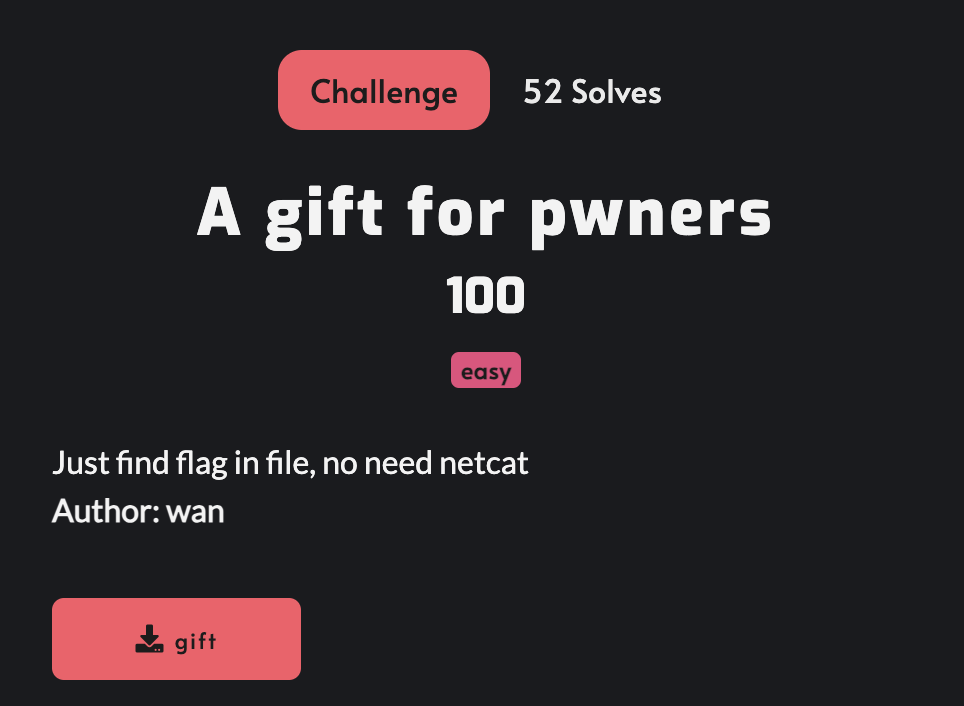
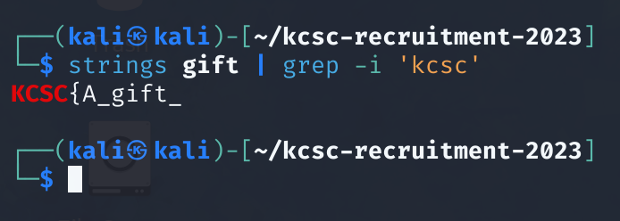
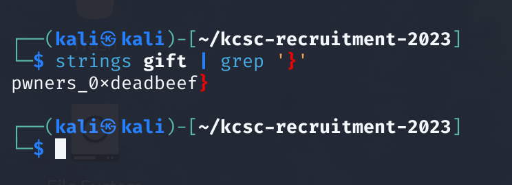
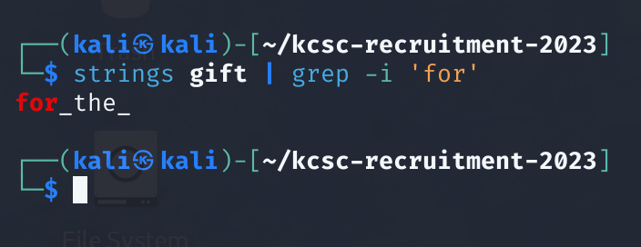

# A gift for pwners

Tải xuống file gift và em đã thử command `strings gift | grep -i kcsc` thì lấy được 1 phần của `flag`.

Thử tiếp command `strings gift | grep '}'` thì đã lấy được phần cuối của `flag`.

Em ghép 2 phần `flag` lại thì thấy thiếu thiếu. Nhớ đến tên challenge là "A gift for pwners" nên em dùng command `strings gift | grep -i 'for'` lấy được phần ở giữa.

## Flag
`KCSC{A_gift_for_the_pwners_0xdeadbeef}`

