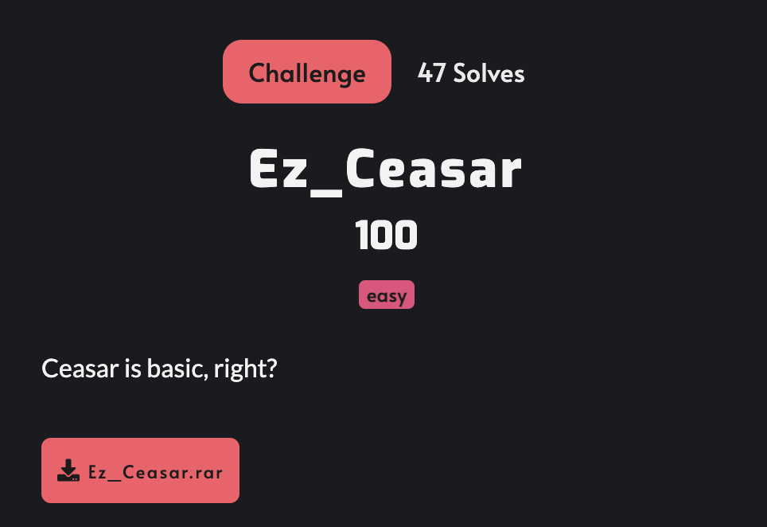

# Ez_Ceasar



```python
import string
import random

alphabet = string.ascii_letters + string.digits + "!{_}?"

flag = 'KCSC{s0m3_r3ad4ble_5tr1ng_like_7his}'
assert all(i in alphabet for i in flag)

key = random.randint(0, 2**256)

ct = ""
for i in flag:
    ct += (alphabet[(alphabet.index(i) + key) % len(alphabet)])

print(f"{ct=}")

# ct='ldtdMdEQ8F7NC8Nd1F88CSF1NF3TNdBB1O'
```
Theo tên của challenge cùng với source code thì đây là dạng mã hoá Caersar.

Cần phải tìm được key nên em đã viết script để thực hiện brute-force.
```python
import string

alphabet = string.ascii_letters + string.digits + "!{_}?"

ct = 'ldtdMdEQ8F7NC8Nd1F88CSF1NF3TNdBB1O'

for key in range(100):
    pt = ""
    for i in ct:
        pt += (alphabet[(alphabet.index(i) - key) % len(alphabet)])
    print(f"Key: {key} pt: {pt}")
    if "KCSC" in pt:
        break
```
## Flag
`KCSC{C3as4r_1s_Cl4ss1c4l_4nd_C00l}`