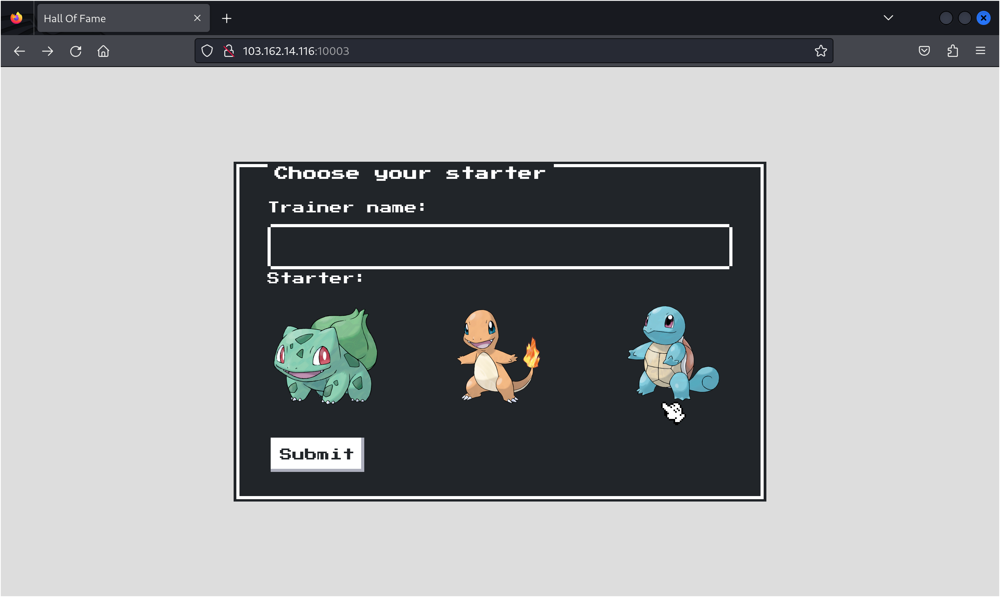

# Pokemon Hof Panel Level 1


Sau khi truy cập trang challenge, thấy được giao diện login.


Em thử `Trainer name` là `abc` và chọn `Starter` rồi submit thì trang hiện lên thông báo.


Vào check file `champ.php`
```php
if (isset($_COOKIE["trainer_data"])) {
    $base64Encoded = $_COOKIE["trainer_data"];
    $serializedUser = base64_decode($base64Encoded);
    $user = unserialize($serializedUser);
    if (isChampion($user)) {
        $title = "Champion Pannel";
        $msg = "Hello, " . $user->getname() . " KCSC{level1_fakeflag}";
    } else {
        $title = "Trainer Pannel";
        $msg = "Access denied. You are not a champion.";
    }
} else {
    $title = "Something's wrong!!!";
    $msg = "No trainer data found. Please choose your starter.";
}
```
- Giá trị ban đầu của `trainer_data` được encode base64
- Sau đó được decode base64.
- Dữ liệu được decode sẽ ở dạng serialized.
- Xác thực champion thông qua biến `isChampion`.

Quay trở lại web để lấy cookie và decode base64.


Thấy được giá trị của biến `isChampion` đang là 0 nên em đã đổi thành 1 rồi lại encode về base64.


Thay giá trị của cookie `trainer_data` bằng chuỗi trong phần output, reload trang là thấy được `flag`.
